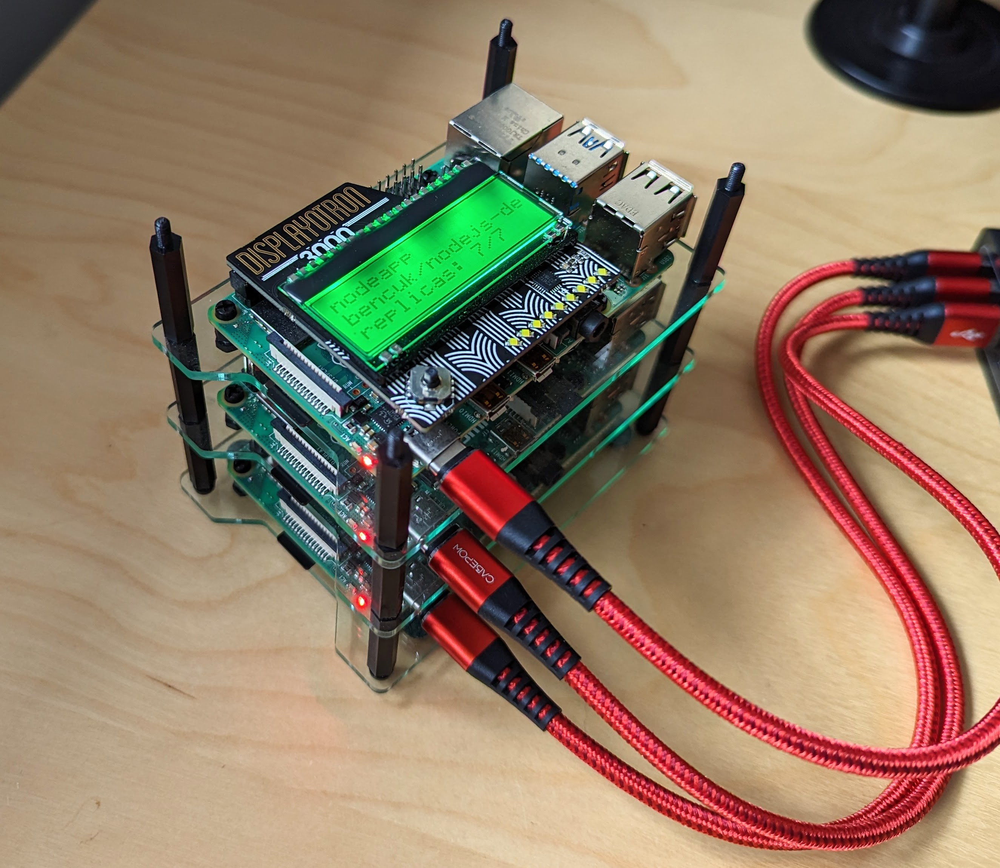

# Project PiKube

_Project PiKube_ is a slightly grandiose title for my personal guide to building your own Kubernetes cluster, using a small number of Raspberry Pis. This is a "bare metal" approach and we'll be installing & setting up Kubernetes from scratch, how exciting! 

If you've never used Kubernetes before, this will probably not be a good starting point, I suggest getting some familiarity before you begin (try kind, k3s or minikube). You will also need to be reasonably Linux/Unix savvy 

 

Updated Feb 2024: This guide was (re)written for Raspberry Pi OS Debian 12 aka Bookworm, and Kubernetes 1.29

# 🚩 Pre-reqs

## Hardware

I am not going to provide a fixed bill of materials for what you need, but at a minimum have at least two spare Raspberry Pi in order to make this worthwhile. For reference this is what I used:

- 3 x Raspberry Pi 4
- 3 x microSDHC cards (I used 32GB, I'm sure 16GB would work too)
- 3 x Short 30cm USB C cables (There's 1000s on Amazon, find one that sells a pack of 3+)
- 1 x [Multi port USB Power block from Anker](https://www.amazon.co.uk/gp/product/B00VTI8K9K)
- 2 x [Cluster case / rack](https://thepihut.com/products/cluster-case-for-raspberry-pi)

I used one Raspberry Pi as a master node, and two as worker nodes

## Software

- A SSH client
- A decent terminal/shell
- [kubectl](https://kubernetes.io/docs/tasks/tools/#kubectl) (optional but recommended)

# 🍔 Installing the OS

Rather than a step by step guide, these steps are very condensed as they do cover anything specific to this project. If this is your first time with a Raspberry Pi you might want to get familiar with using it and setting it up first.

- Download Raspberry Pi OS 64-bit lite (headless) edition: https://downloads.raspberrypi.com/raspios_lite_arm64/images/
- Image all SD cards with the official imaging tool https://www.raspberrypi.com/software/
  - During the imaging process pick the option to customise the OS; enable WiFi, set hostnames, enable SSH with your own SSH pub-key
  - Pick names for your nodes, I went for `master` `node1` and `node2`
- Get all nodes booted and on the network

⚠ IMPORTANT: It's **highly** recommended to set static IPs for all nodes, [see the appendix](#appendix-1---static-ip-on-raspberry-pi-os-bookworm)

Other notes:

- Simply joining the Pis to your home WiFi network works very well. Surprisingly there is no need to use ethernet, or set up a dedicated network or hub for the cluster, of course you can if you wish, this is an exercise left to the reader
- We will do the install of Kubernetes using SSH, so ensure you can SSH into the nodes from your machine either with a password or SSH keys (I would strongly advise SSH keys!)
- You should not need a keyboard or screen connected to the Pis if you enabled SSH and have them on your network (i.e. configured with WiFi) unless something has gone wrong!

# 💾 Base Configuration & Setup (all nodes)

Nearly every command we will be running will require root access, rather than place sudo literally everywhere, you should switch to root user with `sudo su -` for all of the setup, install and initial configuration

Update the OS and install common packages

```sh
apt update && apt -y full-upgrade
apt -y install iptables apt-transport-https gnupg2 software-properties-common \
  apt-transport-https ca-certificates curl vim git
```

Disable swap, it's probably not enabled but just in case

```sh
swapoff -a
sudo dphys-swapfile swapoff && \
sudo dphys-swapfile uninstall && \
sudo systemctl disable dphys-swapfile
```

Enable iptables as kube-proxy uses it

```sh
update-alternatives --set iptables /usr/sbin/iptables-legacy
update-alternatives --set ip6tables /usr/sbin/ip6tables-legacy
```

Enable some kernel modules which are needed

```sh
tee /etc/modules-load.d/k8s.conf <<EOF
overlay
br_netfilter
EOF

modprobe overlay
modprobe br_netfilter
```

Edit kernel boot command `/boot/firmware/cmdline.txt` and add the following to the end

```text
cgroup_enable=cpuset cgroup_enable=memory cgroup_memory=1
```

Configure the IP stack with some sysctl tunables

```sh
tee /etc/sysctl.d/kubernetes.conf <<EOF
net.bridge.bridge-nf-call-ip6tables = 1
net.bridge.bridge-nf-call-iptables = 1
net.ipv4.ip_forward = 1
EOF

sysctl --system
```

**⚠ IMPORTANT**: Now reboot the system

# 📦 Install Container Runtime (all nodes)

We will install & use containerd. These steps should also be run as root.

```sh
curl -fsSL https://download.docker.com/linux/debian/gpg | gpg --dearmor -o /etc/apt/trusted.gpg.d/debian.gpg
add-apt-repository "deb [arch=$(dpkg --print-architecture)] https://download.docker.com/linux/debian $(lsb_release -cs) stable"
apt update
apt install -y containerd.io
```

Create default containerd configuration

```sh
mkdir -p /etc/containerd
containerd config default | tee /etc/containerd/config.toml
```

**⚠ IMPORTANT**: Set cgroup driver for runc to use systemd. See [note](https://kubernetes.io/docs/setup/production-environment/container-runtimes/#containerd-systemd). If you forget this step, Bad Things(TM) happen later and you won't get any helpful error messages to explain why.

```sh
sudo sed -i 's/            SystemdCgroup = false/            SystemdCgroup = true/' /etc/containerd/config.toml
```

You can also edit /etc/containerd/config.toml manually to make this change if sed is too hacky for your tastes.

Now enable & start containerd

```sh
systemctl restart containerd
systemctl enable containerd
```

# ☸️ Install core Kubernetes (all nodes)

Add the Kubernetes package repositories. Note these are the [new k8s.io community repos](https://kubernetes.io/blog/2023/08/15/pkgs-k8s-io-introduction/).

```sh
KUBE_VER="v1.29"

echo "deb [signed-by=/etc/apt/keyrings/kubernetes-apt-keyring.gpg] https://pkgs.k8s.io/core:/stable:/$KUBE_VER/deb/ /" | tee /etc/apt/sources.list.d/kubernetes.list
curl -fsSL https://pkgs.k8s.io/core:/stable:/$KUBE_VER/deb/Release.key | gpg --dearmor -o /etc/apt/keyrings/kubernetes-apt-keyring.gpg
```

Install kubelet, kubeadm and kubectl, they are kinda important!

```sh
apt update
apt install -y kubelet kubeadm kubectl
```

Verify if you're feeling paranoid

```sh
kubectl version --client
kubeadm version
```

# 👑 Install Control Plane (master only)

Ok now we're ready to actually start getting Kubernetes set up, first enable the kubelet service on the master node

```sh
systemctl enable kubelet
```

Pull the images need by Kubernetes

```sh
kubeadm config images pull
```

Now you are ready to initialize the control plane. I highly suggest running a single master node so you don't need to worry about some of the many (many!) advanced options when running `kubeadm init`.  
Note `10.244.0.0/16` is the pod CIDR that Flannel likes to use by default (see below)

```sh
kubeadm init --pod-network-cidr=10.244.0.0/16
```

**⚠ IMPORTANT** Make a note of the join details that are output, this will be shown once the init process is complete

Still as the root user you can use `kubectl` to validate everything is started up. Note the CoreDNS pods will not start until after the next step, so don't worry about them.

```sh
export KUBECONFIG=/etc/kubernetes/admin.conf
kubectl get pods -A
```

Now you can stop running as root, switch to a regular user (but still on the master node) and run the following to configure kubectl for that user

```sh
mkdir -p $HOME/.kube
sudo cp -i /etc/kubernetes/admin.conf $HOME/.kube/config
sudo chown $(id -u):$(id -g) $HOME/.kube/config
```

Install a pod overlay network add-on, we'll use Flannel as it's simple and does the job, but [many other options are available](https://kubernetes.io/docs/concepts/cluster-administration/addons/)

```sh
kubectl apply -f https://github.com/flannel-io/flannel/releases/latest/download/kube-flannel.yml
```

Validate and check the CoreDNS & kube-flannel pods start up

```sh
kubectl get po -A
```

If everything is running you have a working Kubernetes master and control plane! 

**Optional but HIGHLY recommended**: You really shouldn't need to be SSH'ed into your cluster in order to do anything, so now is a good time to scp the kube config file to outside the master to allow remote admin (kubectl) from your dev machine or other system

```sh
scp master:~/.kube/config ~/pikube.config
export KUBECONFIG=~/pikube.config
kubectl get pods -A
```

# 🛠️ Join Worker Nodes (workers only)

Adding additional worker nodes to the cluster is very easy, and when you finished running the `kubeadm init` on the master you would have been given a command to join other nodes, below is just an example

```sh
sudo kubeadm join 192.168.0.150:6443 \
  --token __CHANGE_ME__ \
  --discovery-token-ca-cert-hash __CHANGE_ME__
```

If you missed or lost the output after the `kubeadm init` step, then you can SSH onto the master and use the `kubeadm token` command to create a new one.

Validate the node(s) joined the cluster successfully by running `kubectl get node`

It also helps to label your node(s) as workers, e.g.

```sh
kubectl label node __CHANGE_ME__ node-role.kubernetes.io/worker=worker
```

You can repeat this step for each of your worker nodes

# 💡 Conclusion

OK you should now have a basic but functional Kubernetes cluster, deploy a test web application by running `kubectl apply -f ./samples/test-app.yaml` to verify everything is working.  

Then run `kubectl get pods -o wide` and check the pods are running and they are assigned to your worker nodes

Go to the following URL `http://master:30000/` (assuming your master node hostname is `master`) to open the app

# 🐾 Next Steps

There's practically an endless number of things you can do next with your cluster, however there are a few common next steps to get it to the next level and more functional

- Deploy metrics server by running: `kubectl apply -f samples/metrics-server.yaml`
- Add an gateway controller - *Coming soon! This has totally changed since I last used Kubernetes!*
- [Deploy Kubernetes dashboard](./dashboard.md)
- [Enable NFS based storage for persistent volumes](./storage/)
- Support load balancing with MetalLB - *Coming soon!*
- [Enable Prometheus and Grafana](./monitoring/)
- If you have a [Display-o-tron 3000](https://shop.pimoroni.com/products/display-o-tron-hat) I have created [a Python script to display all sorts of details about your cluster](./status-dot3k/)

---

## Appendix 1 - Static IP on Raspberry Pi OS Bookworm

There's a lot of outdated information on setting static IP on the Raspberry Pi, and as of version 'Bookworm' (Oct 2023) the method has changed drastically, and now uses network manager and NOT dhcpcd

You'll need to find the name of the network config for the network interface you are using (either eth0 or wlan0)

```sh
sudo nmcli c show
```

To set the connection to be static, the following commands can be used.  
Obviously modify the `__CHANGE_ME__` to the connection name, and IP addresses below to what you need, and don't just copy, paste & run!

```sh
sudo nmcli c mod '__CHANGE_ME__' ipv4.addresses 192.168.0.150/24 ipv4.method manual
sudo nmcli c mod '__CHANGE_ME__' ipv4.gateway 192.168.0.1
sudo nmcli c mod '__CHANGE_ME__' ipv4.dns 192.168.0.1
```

In my case my three nodes were 192.168.0.150 ~ 152 and my router & DNS server was on 192.168.0.1

Assuming you are making these changes via SSH, it's simplest to reboot to the IP address change take effect.
